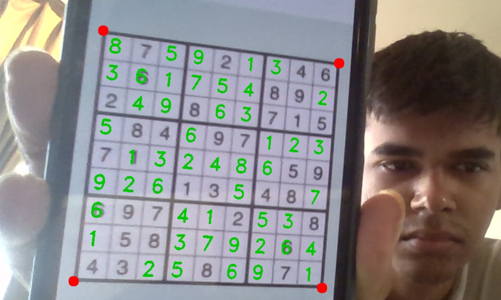
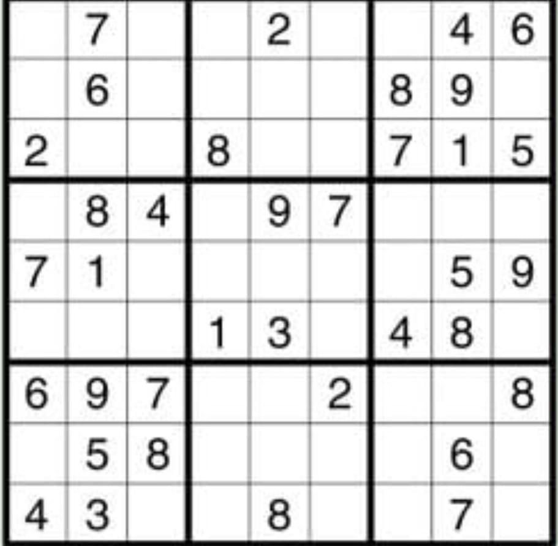
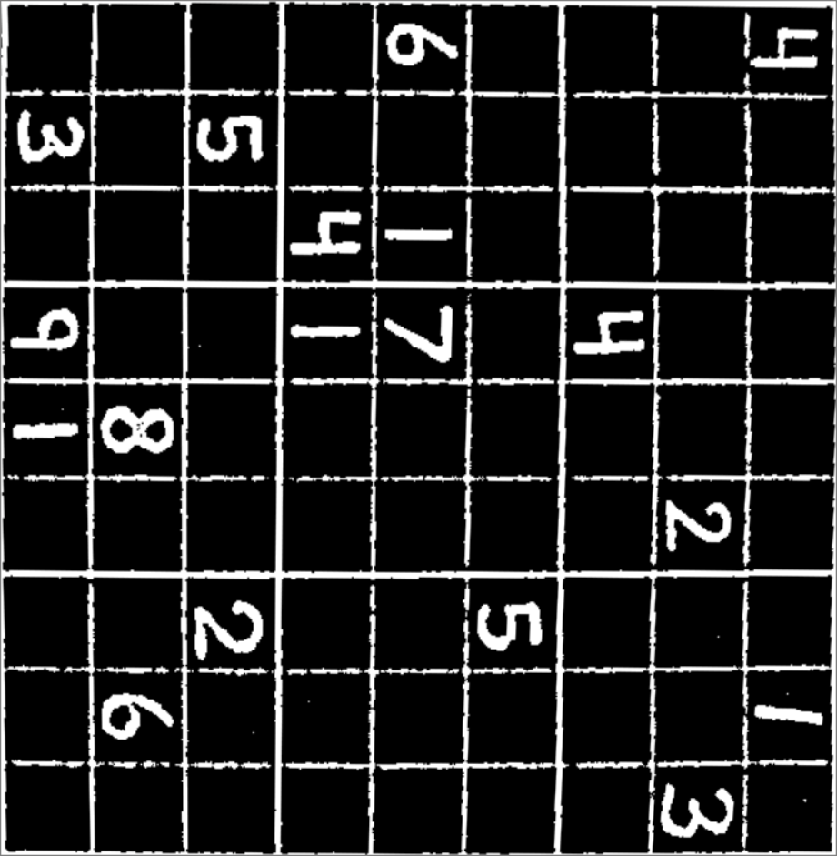

# Webcam-Sudoku-Master

## Table of contents
* [What is Webcam Sudoku Master?](#What-is-Webcam-Sudoku-Master?)
* [Code requirements](#Code-requirements)
* [Installation](#Installation)
* [Usage](#Usage)
* [How does it work?](#How-does-it-work?)
* [Status](#Status)

## What is Webcam Sudoku Master?


## Code requirements
Python 3.11 with following modules installed:
* NumPy 1.24 
* TensorFlow 2.14 
* Keras 2.14
* Matplotlib 3.8 
* OpenCV 4.9

## Installation
Simply download the project as a compressed folder or clone it.
Then you have to make sure that [Code requirements](#Code-requirements) are met.
In order to run the program you don't have to train your own AI model. 
Already trained one is saved in Models folder. 
Using Terminal/Command Prompt navigate to the correct directory and run main_file.py using the following command: python main_file.py

## Usage
After running main_file.py you should see a window that shows live feed from your webcam.
Now place a sudoku in the webcam's field of view.
And that's all. In the window should appear a solution.
If the solution doesn't appear, or the program doesn't even locate the sudoku, try to move it closer/further to the webcam. If it doesn't help, you may need to improve the lighting quality.

## How does it work?
Short explanation - algorithm:
* read a frame from a webcam
* convert that frame into grayscale
* binarize that frame
* find all external contours
* get the biggest quadrangle from that contours
* apply warp transform (bird eye view) on the biggest quadrangle
* split that quadrangle into 81 small boxes
* check which boxes contain digits
* extract digits from boxes that aren't empty
* prepare that digits for a CNN model
* while not solved and iterations of the loop <= 4:
	* rotate the digits by (90 * current iteration) degrees
	* classify the digits using a CNN model
	* if an average probability is too low go to the next iteration of the loop
	* compare the digits with a previous solution
	* if the digits are part of the previous solution then we don't need to solve the sudoku again - break the loop
	* try to solve the sudoku
	* if solved correctly break the loop
* return a copy of the frame (with a solution if any were found)

Precise explanation - code analysis:  

As I said before, the program starts in main_file.py.  
First of all we have to import the source code and some libraries from other files.
```python
print('Importing a source code and libraries from other files...')

from webcam_sudoku_solver import *

import os
os.environ['TF_CPP_MIN_LOG_LEVEL'] = '3'  # hide tf warnings
import tensorflow as tf
```

Then main function starts.  
First task of the function is to prepare a CNN model and a webcam.
```python
model = tf.keras.models.load_model('Models/handwritten_cnn.h5')

webcam_width, webcam_height = 1920, 1080
webcam = cv.VideoCapture(0)
webcam.set(cv.CAP_PROP_FRAME_WIDTH, webcam_width)
webcam.set(cv.CAP_PROP_FRAME_HEIGHT, webcam_height)
```

Now main loop of the program starts.  
We'll use there a object of WebcamSudokuSolver class - the core of the program.  
```python
# create the core of the program
webcam_sudoku_solver = WebcamSudokuSolver(model)
```

At the beginning of each iteration of main loop a frame is read from a webcam.  

  


Then that frame is passed as an argument to the object of WebcamSudokuSolver class using solve function.  
The function returns a copy of that frame (with a drawn solution if any has been found).  
How does solve function convert a webcam frame into a frame with solution? I'll explain it in a moment.
But now let's see what happens with that returned frame.  
That frame is just displayed.
We also check if a user has pressed a key (if so, the program is closed).

```python
print('Logs:')
while webcam.isOpened():
	successful_frame_read, frame = webcam.read()

	if not successful_frame_read:
		break

	# run the core of the program
	output_frame = webcam_sudoku_solver.solve(frame)

	# output results
	cv.imshow('Webcam Sudoku Solver', output_frame)

	# check if a user has pressed a key, if so, close the program
	if cv.waitKey(1) >= 0:
		break

cv.destroyAllWindows()
webcam.release()
```

If there are no errors, the following information will be displayed at the very end of the program:  
"Code is done, so everything works fine!".  

But how does solve function convert a webcam frame into a frame with solution?

To answer this question we have to move to webcam_sudoku_solver.py file. 

First task of the function is to extract a sudoku board.

  


The program assumes that a sudoku board as the biggest quadrangle in a frame.
I'm not going to explain how get_biggest_quadrangle function exactly works,
but if you are curious about this, you can check this out by yourself.
All functions that I won't discuss in detail are defined under WebcamSudokuSolver class.
```python
if frame is None:
	return frame

frame = deepcopy(frame)

warp_sudoku_board, warp_matrix = get_biggest_quadrangle(frame)

if warp_sudoku_board is None:
	return frame
```
As you can see if the function won't solve the sudoku then it will return an unchaged copy of the frame.  

Next step is to split that board into 81 boxes.
```python
boxes = get_boxes(warp_sudoku_board)
```

When is a box empty and when does a box contain a digit?
Using trials and errors technique, I developed the following algorithm:
* copy a box
* crop that copy on each side by 15%
* find all external contours
* if there are no contours it means there is no digit - return False
* if there is at least one external contour get the biggest (only the biggest could be a digit)
* if an area of that contour is too small it means there is no digit - return False
* get a bounding rectangle of the biggest contour
* if width and height of that rectangle is too small it means there is no digit - return False
* return True - there is a digit

The algorithm is implemented in check_digits_occurrence function
```python
digits_occurrence = check_digits_occurrence(boxes)
```

Now it's time to get inputs for a CNN model from boxes that contain digits
```python
inputs = prepare_inputs(boxes, digits_occurrence)
if inputs is None:
	return frame
```

The program works with sudoku rotated in every way,  
but cropped and warped boards which are returned by get_biggest_quadrangle function may be rotated only in 4 ways - by 0, 90, 180 or 270 degrees.  
That's just how get_biggest_quadrangle function works.

We don't know which rotation is correct, so we need to try solve it even 4 times.
```python
current_attempt = 1
while current_attempt <= 4:
	rotation_angle = self.last_solved_sudoku_rotation + 90 * (current_attempt - 1)

	rotated_inputs = rotate_inputs(inputs, rotation_angle)

	predictions = self.model.predict([rotated_inputs])

	if not probabilities_are_good(predictions):
		current_attempt += 1
		continue

	digits_grid = get_digits_grid(predictions, digits_occurrence, rotation_angle)

	if self.new_sudoku_solution_may_be_last_solution(digits_grid):
		self.last_solved_sudoku_rotation = rotation_angle

		result = inverse_warp_digits_on_frame(
			digits_grid, self.last_sudoku_solution, frame, warp_sudoku_board.shape, warp_matrix, rotation_angle
		)

		return result

	solved_digits_grid = sudoku_solver.solve_sudoku(digits_grid)
	if solved_digits_grid is None:
		current_attempt += 1
		continue

	self.last_sudoku_solution = solved_digits_grid
	self.last_solved_sudoku_rotation = rotation_angle

	result = inverse_warp_digits_on_frame(
		digits_grid, solved_digits_grid, frame, warp_sudoku_board.shape, warp_matrix, rotation_angle
	)

	return result

return frame
```
Let's analyze this loop step by step.  

First an angle is calculated and inputs for a CNN model are rotated. 
```python
rotation_angle = self.last_solved_sudoku_rotation + 90 * (current_attempt - 1)

rotated_inputs = rotate_inputs(inputs, rotation_angle)
```

Now a CNN model can predict.
```python
predictions = self.model.predict([rotated_inputs])
```

If an average probability isn't high enough it means the current rotation isn't correct. We can skip to the next iteration.  
Notice that if it is 4th iteration then the function won't solve the sudoku and will return a copy of the frame without any changes. 
```python
if not probabilities_are_good(predictions):
	current_attempt += 1
	continue
```

If an average probability is high enough we can get a grid with recognized digits.
```python
digits_grid = get_digits_grid(predictions, digits_occurrence, rotation_angle)
```

This function always returns a "vertically normalized" grid so it always can be compared with the previous solution, regardless of their rotation.  

Comparing the current grid with the previous solution:
```python
if self.new_sudoku_solution_may_be_last_solution(digits_grid):
```

If a solution of the current grid can be equal to the previous solution we don't have to solve the current sudoku at all.
```python
if self.new_sudoku_solution_may_be_last_solution(digits_grid):
	self.last_solved_sudoku_rotation = rotation_angle

	result = inverse_warp_digits_on_frame(
		digits_grid, self.last_sudoku_solution, frame, warp_sudoku_board.shape, warp_matrix, rotation_angle
	)

	return result 
```

Otherwise solve function will try to solve the current sudoku.
```python
solved_digits_grid = sudoku_solver.solve_sudoku(digits_grid)
```

If that sudoku is unsolvable it means that the current rotation isn't correct after all.
```python
if solved_digits_grid is None:
	current_attempt += 1
	continue
```

But if that sudoku has been solved correctly we overwrite the previous solution.
```python
self.last_sudoku_solution = solved_digits_grid
self.last_solved_sudoku_rotation = rotation_angle
```

Draw the current solution on a copy of the current frame and return it.  

  


```python
result = inverse_warp_digits_on_frame(
	digits_grid, solved_digits_grid, frame, warp_sudoku_board.shape, warp_matrix, rotation_angle
)

return result
```

If we couldn't find any solution of the sudoku in any rotation, we return the image without any solution.
```python
return frame
```
And this is how solve function works.  
If you are curious about utilities-functions that are called by solve function then check their definitions and descriptions which are located in webcam_sudoku_solver.py file below WebcamSudokuSolver class.

But there is also one more point to be discussed:  
How does solve_sudoku function solve a sudoku puzzle?
```python
solved_digits_grid = sudoku_solver.solve_sudoku(digits_grid)
```

To check how it works we need to move to sudoku_solver.py.
This file will be discussed in exactly the same way as the previous one -
I will discuss in detail only an externally called function
where the whole algorithm starts and ends.  

First we need to check if the sudoku is solvable at all. 
```python
if not is_solvable(digits_grid):
	return None
```

The algorithm is based on pencilmarks that we use to help ourself solve sudoku in real life.  
I called them human_notes.
```python
human_notes = get_full_human_notes(digits_grid)
```
The sudoku is solved in a loop.
```python
while True:
	sth_has_changed1 = remove_orphans_technique(digits_grid, human_notes)

	sth_has_changed2 = single_appearances_technique(digits_grid, human_notes)

	if not sth_has_changed1 and not sth_has_changed2:
		break
```
Each iteration of the loop calls two functions: remove_orphans_technique and single_appearances_technique.
Their task is to successively delete unnecessary notes and complete the sudoku.
The loop ends when the functions doesn't change anything anymore. It means the sudoku is solved or can't be solved using this technique.  
After the loop we check if that sudoku is solved correctly (so we check also if is solved at all).
```python
if is_solved_correctly(digits_grid):
	return digits_grid
return None
```

There is a very popular technique for solving sudoku called backtracking algorithm. I didn't choose that technique because it works too slowly on more difficult puzzles. However, it has one advantage - can solve sudoku with more than one solution. My algorithm can't do it, because it is an ambigous case.
I have an idea how to integrate the second algorithm with the project - multithreading.
Solve function can try to solve the sudoku using those 2 techniques at the same time and 
if one of them succeeds then the function ends. But it's only an idea. Perhaps some day I will implement it.

## Status
Project is _finished_, but there are still some things that can be improved:
Future improvements could include:

* Enhanced User Interface: Developing a more intuitive and user-friendly interface for  better user experience.
* Advanced Image Processing: Using more advanced techniques like deep learning-based object detection for more accurate grid and digit extraction.
* Mobile Integration: Creating a mobile application version for more convenient use on smartphones.
* Real-Time Feedback: Implementing real-time feedback mechanisms to guide users in capturing better quality images for improved accuracy.
* Additional Features: Adding features like hint generation, puzzle validation, and difficulty estimation to make the solver more versatile and useful.

